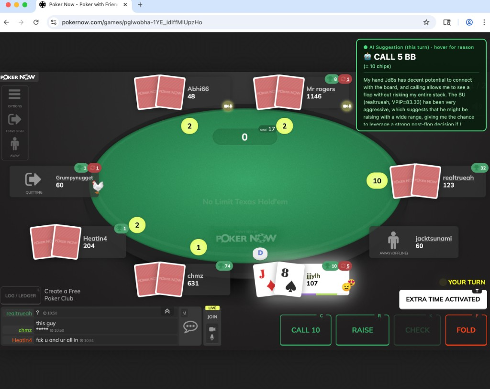

## PokerNow GPT

<a id="readme-top"></a>



<!-- TABLE OF CONTENTS -->
<details>
  <summary>Table of Contents</summary>
  <ol>
    <li>
      <a href="#about-the-project">About The Project</a>
      <ul>
        <li><a href="#modes">Modes: Auto-play vs Assistant</a></li>
        <li><a href="#why-llm">Why an LLM over GTO?</a></li>
        <li><a href="#built-with">Built With</a></li>
      </ul>
    </li>
    <li>
      <a href="#getting-started">Getting Started</a>
      <ul>
        <li><a href="#prerequisites">Prerequisites</a></li>
        <li><a href="#installation">Installation</a></li>
        <li><a href="#configuration">Configuration</a></li>
        <li><a href="#running">Running</a></li>
      </ul>
    </li>
    <li><a href="#supported-models">Supported Models</a></li>
    <li><a href="#license">License</a></li>
    <li><a href="#acknowledgements">Acknowledgements</a></li>
    <li><a href="#contact">Contact</a></li>
  </ol>
</details>


<!-- ABOUT THE PROJECT -->
## About The Project

An AI-powered poker assistant for [PokerNow](https://www.pokernow.club) that uses LLMs (ChatGPT, Gemini, etc.) to analyse live games and suggest — or automatically execute — actions.

The bot scrapes the live game page and fetches game logs from PokerNow, building a real-time model of the table:

- Stakes (blinds, game type)
- Your hole cards
- Every player's position, stack size, and actions
- Community cards and current street
- Pot size

This information is structured into a prompt and sent to the configured LLM. The response is parsed into a concrete action (`fold`, `call`, `check`, `raise`, `bet`, or `all-in`). Query history is maintained across a single hand so the model can "remember" previous actions (e.g. who was the preflop aggressor).

A per-session cache tracks opponent stats (VPIP, PFR) and persists them in a local SQLite database. These stats are fed back into future queries to enable personalised exploitative adjustments.

<p align="right">(<a href="#readme-top">back to top</a>)</p>

---

<a id="modes"></a>
### Modes: Auto-play vs Assistant

| | **Auto-play mode** | **Assistant mode** |
|---|---|---|
| Who clicks | The bot | **You** |
| AI role | Makes decisions and executes them | Displays a suggestion; you decide |
| Browser | Headless (hidden) | Visible — connects to your Chrome |
| How to enable | `bot_config.json` → `"assistant_mode": false` | `bot_config.json` → `"assistant_mode": true` |

**Assistant mode overlay** — when it is your turn, a floating widget appears in the top-right corner of the game page:

```
● AI Suggestion (this turn) · hover for reason
🤖  RAISE  8 BB
    (= 16 chips)
```

Hover over the widget to see the one-sentence reasoning. After your turn the widget dims to indicate it is from the previous round.

<p align="right">(<a href="#readme-top">back to top</a>)</p>

---

<a id="why-llm"></a>
### Why an LLM over GTO?

GTO (Game Theory Optimal) strategies are mostly solved for heads-up play and become harder to apply in multi-way pots, which are common at casual online tables.

GTO solvers also cannot incorporate live opponent statistics. By feeding each player's VPIP and PFR into the prompt, the LLM can make exploitative adjustments — for example, widening a call range against a known fish or folding more often against a nit.

As LLMs continue to improve, their poker reasoning will naturally improve alongside them.

<p align="right">(<a href="#readme-top">back to top</a>)</p>

---

### Built With

* [Node.js][Node-url]
* [Puppeteer][Puppeteer-url]
* [OpenAI SDK][OpenAI-url]
* [Google Generative AI SDK][Google-url]
* [SQLite][SQLite-url]
* [Express][Express-url]

<p align="right">(<a href="#readme-top">back to top</a>)</p>


<!-- GETTING STARTED -->
## Getting Started

<a id="prerequisites"></a>
### Prerequisites

- **Node.js** v18 or higher
- **Google Chrome** installed at `/Applications/Google Chrome.app` (macOS) — required for assistant mode
- An **OpenAI** or **Google AI** API key

---

<a id="installation"></a>
### Installation

1. Clone the repo
   ```sh
   git clone https://github.com/your-username/pokernow-gpt.git
   cd pokernow-gpt
   ```

2. Install dependencies
   ```sh
   npm install
   ```

3. Create a `.env` file in the project root
   ```env
   OPENAI_API_KEY=your_openai_key_here
   GOOGLEAI_API_KEY=your_google_key_here
   ```

---

<a id="configuration"></a>
### Configuration

**`app/configs/ai-config.json`** — choose your AI provider and model

```json
{
  "provider": "OpenAI",
  "model_name": "gpt-4o-mini",
  "playstyle": "neutral"
}
```

> `playstyle` options: `"neutral"` · `"aggressive"` · `"passive"` · `"pro"`

**`app/configs/bot-config.json`** — toggle auto-play vs assistant mode

```json
{
  "debug_mode": 1,
  "query_retries": 2,
  "assistant_mode": true
}
```

**`app/configs/webdriver-config.json`** — browser settings

```json
{
  "default_timeout": 5000,
  "headless_flag": true,
  "use_existing_browser": true,
  "debugging_port": 9222
}
```

> Set `"use_existing_browser": true` together with `"assistant_mode": true` to connect the bot to your own Chrome window instead of opening a hidden one.

---

<a id="running"></a>
### Running

#### Option A — One command (recommended)

```sh
npm start
```

This will:
1. Launch a dedicated Chrome window with remote debugging enabled
2. Start the bot — enter the game ID when prompted

Then in the Chrome window:
1. Navigate to your PokerNow game
2. Click an empty seat, enter your name and stack size, submit
3. Wait for the host to approve — the AI starts automatically

#### Option B — Manual steps

```sh
# Step 1: open Chrome with the debug port
./start-chrome.sh

# Step 2 (in a new terminal): start the bot
npx tsx app/index.ts
```

<p align="right">(<a href="#readme-top">back to top</a>)</p>


<!-- SUPPORTED MODELS -->
## Supported Models

| Provider | Models |
|----------|--------|
| `OpenAI` | `gpt-3.5-turbo` · `gpt-4-turbo` · `gpt-4o` · `gpt-4o-mini` |
| `Google` | `gemini-1.5-flash` · `gemini-1.0-pro` · `gemini-1.5-pro` |

> **Recommended:** `gpt-4o-mini` — best balance of speed, cost, and quality for in-game decisions.

<p align="right">(<a href="#readme-top">back to top</a>)</p>


<!-- ACKNOWLEDGEMENTS -->
## Acknowledgements

This project is based on the original [pokernow-gpt](https://github.com/csong2022/pokernow-gpt) by [Chen Song](https://github.com/csong2022).

Key additions in this fork:
- **Assistant mode** — AI suggestions displayed as an in-page overlay instead of auto-clicking
- **Connect to existing Chrome** — attach to your own browser via Chrome DevTools Protocol
- Hover-to-reveal reasoning on the suggestion widget
- Chip equivalent displayed alongside BB amounts
- Performance improvements (parallel log/hand fetching, removed unnecessary delays)
- Bug fixes for mid-hand join and log failure edge cases

<p align="right">(<a href="#readme-top">back to top</a>)</p>

<!-- LICENSE -->
## License

Distributed under the MIT License. See `LICENSE` for more information.

<p align="right">(<a href="#readme-top">back to top</a>)</p>

<!-- CONTACT -->
## Contact

Project Link: [https://github.com/linghaoyang/pokernow-gpt](https://github.com/linghaoyang/pokernow-gpt)

<p align="right">(<a href="#readme-top">back to top</a>)</p>

<!-- MARKDOWN LINKS -->
[Node-url]: https://nodejs.org/en
[Express-url]: https://expressjs.com/
[Puppeteer-url]: https://pptr.dev/
[SQLite-url]: https://www.sqlite.org/
[OpenAI-url]: https://platform.openai.com/docs
[Google-url]: https://ai.google.dev/
